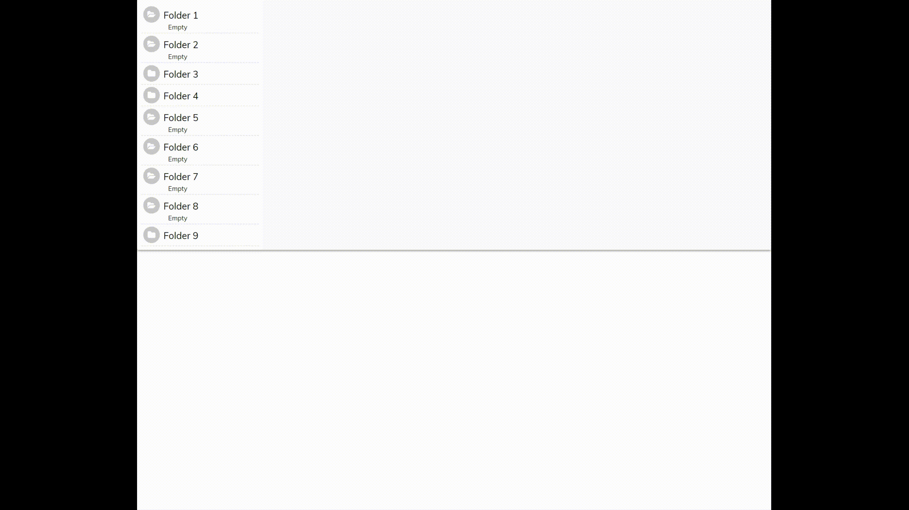

## To Run

```js
import React, { Component } from "react";
import FileWindow from "./Components/Main/FileWindow/FileWindowContainer";
import { getFolders } from "./Services/DirectoriesServices";

class App extends Component {
  constructor(props) {
    super(props);

    this.applySelectedElement = this.applySelectedElement.bind(this);

    this.state = {
      allFolders: getFolders()
    };
  }

  applySelectedElement(selected) {
    this.setState({
      ...this.state,
      selectedElement: selected
    });
  }

  render() {
    return (
      <React.Fragment>
        <div className="App">
          <FileWindow onSelectElement={this.applySelectedElement} data={this.state.allFolders} />
        </div>
      </React.Fragment>
    );
  }
}

export default App;
```

## Sample Data:

```js
{
      token: "d3847453f093f49a0954189a6c2d7017a2f47d7e8cd515fcd4ec4512c15aede8",
      name: "Folder 9",
      folders: [
        {
          token: "71fa14b4b1f4a8ac6677fbbb0f3dbd8118cd448e420f4a93622c3d554d836e0a",
          name: "Folder 9 Child 1",
          folders: [
            {
              token: "991fa14b4b1f4a8ac6677fbbb0f3dbd8118cd448e420f4a93622c3d554d836e0a",
              name: "Folder 9 Child 2",
              folders: []
            }
          ],
          elements: [
            {
              token: "771fa1j4b4b1f4a8ac6677fbbb0f3dbd8118cd448e420f4a93622c3d554d836e0a",
              name: "Folder 9  Child 1 Elemet 1"
            },
            {
              token: "9991fa14b4b1fja8ac6677fbbb0f3dbd8118cd448e420f4a93622c3d554d836e0a",
              name: "Folder 9  Child 1 Element 2"
            }
          ]
        }
      ],
      elements: [
        {
          token: "771fa14b4b1f4a8ac6677fbbb0f3dbd8118cd448e420f4a93622c3d554d836e0a",
          name: "Folder 9 Elemet 1"
        },
        {
          token: "9991fa14b4b1f4a8ac6677fbbb0f3dbd8118cd448e420f4a93622c3d554d836e0a",
          name: "Folder 9 Element 2"
        }
      ]
    }
```

## Sample Tree:



## Something Missing?

If you have ideas for more “How To” recipes that should be on this page, [let us know](https://github.com/bierx/react-redux-file-window/issues)
